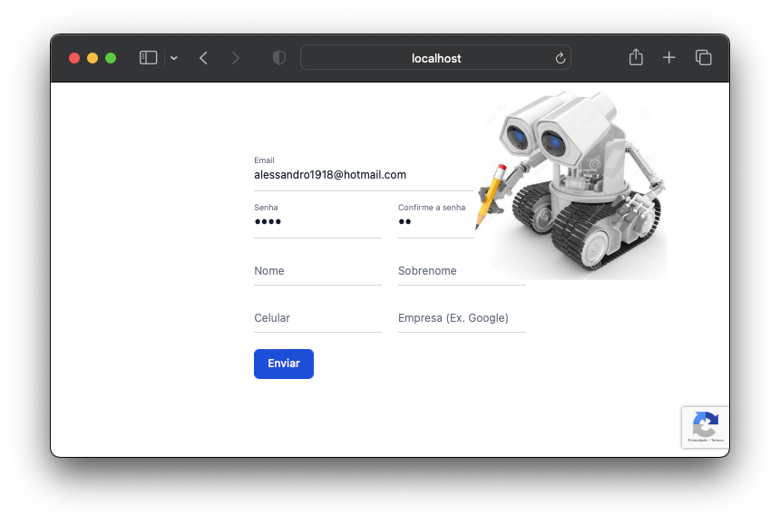

# automate-form

## 🚀 Projeto
Automatize tarefas repetitivas com scripts que controlam seu mouse e teclado!

<div align="center">
  
</div>


## 🛠️ Tecnologias
- [Python 3.x](https://www.python.org/downloads/)
- [PyAutoGUI](https://pyautogui.readthedocs.io/en/latest/index.html)


## 🗂️ Utilização

### 🐑🐑 Clonando o repositório:

```bash
  $ git clone url-do-projeto.git
```

### ▶️ Rodando o App:

```bash
  $ cd automate-form                  #change to this directory
  $ python3 -m pip install pyautogui  #download packages
  $ python3 automate-form.py          #start the project
```

### 🐞 Bugs:
- <code>TypeError: '<' not supported between instances of 'str' and 'int'</code></br>
Problema de versão de um pacote (PIL) usado pelo PyAutoGUI.</br>
Solução:</br>
No arquivo:</br>
<code>"/Library/Frameworks/Python.framework/Versions/3.8/lib/python3.8/site-packages/pyscreeze/__init__.py"</code></br>
Substitur a linha 527:</br>
<code>if tuple(PIL__version__) < (6, 2, 1):</code></br>
Por:</br>
<code>if tuple(map(int, PIL__version__.split("."))) < (6, 2, 1):</code></br>
Fonte:</br>
https://stackoverflow.com/questions/76361049/how-to-fix-typeerror-not-supported-between-instances-of-str-and-int-wh</code></br>


## ⭐ Like, Subscribe, Follow!
Curtiu o projeto? Marque esse repositório com uma Estrela ⭐!
